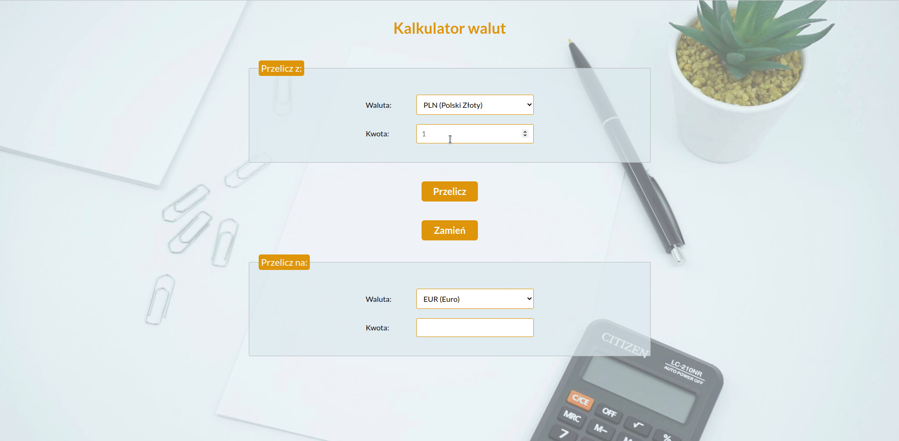

# Currency converter

Hi! This is simple currency converter website I created as a part of learning forms in Java Script.

The user can choose from following currencies: PLN, EUR, GBP, USD.

## Demo

[dondeptu.github.io/currency-converter](https://dondeptu.github.io/currency-converter/)

## Preview

## Technologies
Project is created with:

